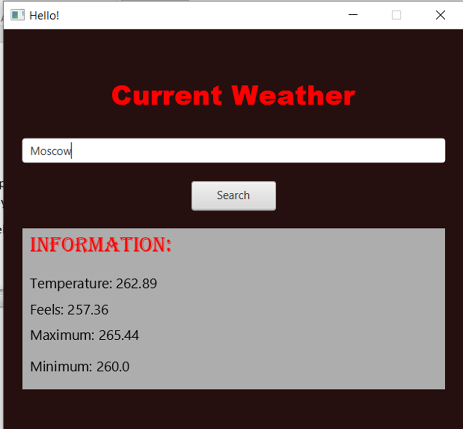

#Current Weather
The main purpose of the project is to create Java interface application, which will display current weather by using API. I will briefly touch every aspect of the program

The main purpose of the project is to create Java interface aThis is how program work. We type the city and get the answer in JSON format from the OpenWeathermap serves, which provides us an API, then by using JSON in java library from maven dependency we can extract desired information from JSON. We can type in Russian or English the name of the city.pplication, which will display current weather by using API. I will briefly touch every aspect of the program
